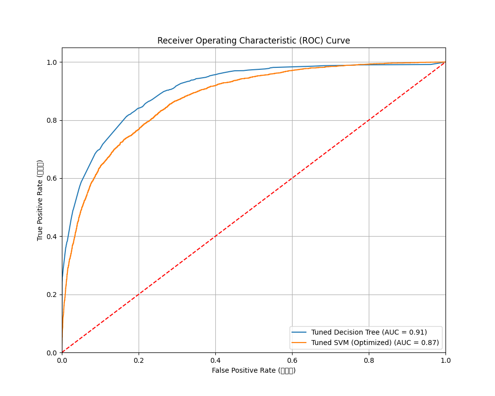

# 简介
* **Census Income Classification Project (普查收入分类项目)**
* **本项目旨在根据1994年的美国人口普查数据，构建并比较两种机器学习模型——决策树 (Decision Tree) 和支持向量机 (Support Vector Machine, SVM)——用于预测一个人的年收入是否超过50,000美元。**
* **该项目是 IN6227 数据挖掘课程作业（Assignment1）**

* # 目录
* **项目目标**
* **数据集**
* **项目工作流**
* **如何运行**
* **最终结果**
* **文件结构**

## 项目目标:

* 对原始普查数据进行加载、清洗和预处理。

* 实现、训练并对决策树和支持向量机两种分类器进行超参数调优。

* 使用多种性能指标（准确率、精确率、召回率、F1分数、AUC值）对两个模型进行全面的评估与比较。

* 得出评估结果。

## 数据集:

本项目使用的数据集是来自 UCI 机器学习库的 Census Income Dataset。

来源: [https://archive.ics.uci.edu/ml/datasets/Census+Income]()

简介: 数据集包含从1994年美国人口普查数据库中抽取的48,842条记录，其中训练集32,561条，测试集16,281条。每个记录包含14个属性（如年龄、职业、教育程度等），目标是预测其收入阶层 (>50K 或 <=50K)。

## 项目工作流:

代码 assignment1_optimized.py执的处理步骤如下：

### 数据加载与清洗:

* 读取 _.data_ 和 _.test_ 文件，并根据 _.names_ 文件添加列名。

* 在加载时将数据中的 _?_ 识别为缺失值。

* 清洗测试集中目标变量末尾多余的 _._ 字符。

* 将训练集与测试集合并，以便进行统一的预处理。

### 数据预处理与特征工程:

### 缺失值处理: 对 workclass, occupation, native-country 这三列中的缺失值，使用该列的众数进行填充。

### 特征编码:

* 将目标变量 income 转换为 1 (>50K) 和 0 (<=50K)。

* 对所有类别型特征（如 sex, race, workclass 等）进行独热编码 (One-Hot Encoding)，并使用 drop_first=True 避免重复。

### 特征缩放: 使用 StandardScaler 对所有数值特征进行标准化，将数据缩放到均值为0、方差为1的分布，消除不同特征尺度差异的影响。

### 模型训练与超参数调优:

#### 决策树: 使用 GridSearchCV（网格搜索）在定义的参数网格上进行5折交叉验证，找到 max_depth 和 min_samples_leaf 等的最佳组合。

#### 支持向量机 (SVM): 考虑到SVM训练速度极慢，采用了一种优化策略：

* 首先从训练集中随机抽取 20% 的数据子集。

* 仅在该子集上使用 RandomizedSearchCV（随机搜索）快速寻找 C 和 gamma 的最佳参数。

* 最后，使用在子集上找到的最佳参数，在完整的训练集上训练一次，得到最终的SVM模型。

### 模型评估与比较:
1. 在独立的测试集上评估两个经过调优的最佳模型。

2. 计算并打印每个模型的分类报告（包含精确率、召回率、F1分数）、总体准确率 (Accuracy) 和预测耗时。

3. 计算每个模型的AUC值，并绘制两个模型的ROC曲线在同一张图中，以便直观比较。

## 如何运行

#### 环境准备:

确保你的 Python 环境中安装了所有必要的库。可以在终端中运行以下命令进行安装：

`pip install pandas numpy scikit-learn matplotlib`

#### 文件放置:

* 将数据文件 _adult.data, adult.test, adult.names_ 放置在 C:\Users\72867\Desktop\ltjl\Census Income Data Set\ （本人目录）目录下。

* 如果你想更改数据路径，请修改Python脚本顶部的 file_path 变量。

#### 执行脚本:

* 在你的IDE（如 PyCharm）或终端中运行 assignment1_optimized.py 脚本：

* _python assignment1_optimized.py_

#### 查看结果:

* 脚本运行的结果和会被打印在控制台中。

* 运行结束后，脚本会在同级目录下生成一个名为 roc_curves.png 的图像文件，其中包含了两个模型的ROC曲线对比。

## 最终结果

**脚本运行完成后,结果如下：**

* 模型性能对比表（示例）

| Model                | Accuracy | Predicition Time | AUC  |
|----------------------|----------|------------------|------|
| Tuned Decision Tree  | 0.864    | 0.005            | 0.91 |
| Tuned SVM(Optimized) | 0.842    | 10.420           | 0.87 |

* ROC 曲线

## 文件结构

/项目文件夹  
|  
|---&nbsp;&nbsp;&nbsp;&nbsp;/Census Income Data Set  
|&nbsp;&nbsp;&nbsp;&nbsp;&nbsp;&nbsp;&nbsp;&nbsp;&nbsp;&nbsp;&nbsp;&nbsp;|-- adult.data  
|&nbsp;&nbsp;&nbsp;&nbsp;&nbsp;&nbsp;&nbsp;&nbsp;&nbsp;&nbsp;&nbsp;&nbsp;|-- adult.test  
|&nbsp;&nbsp;&nbsp;&nbsp;&nbsp;&nbsp;&nbsp;&nbsp;&nbsp;&nbsp;&nbsp;&nbsp;|-- adult.names  
|  
|---&nbsp;&nbsp;&nbsp;&nbsp;assignment1_optimized.py&nbsp;&nbsp;&nbsp;&nbsp;(主代码脚本)  
|---&nbsp;&nbsp;&nbsp;&nbsp;Search_Missing_value.py&nbsp;&nbsp;&nbsp;&nbsp;&nbsp;&nbsp;(主代码脚本)  
|---&nbsp;&nbsp;&nbsp;&nbsp;roc_curves.png&nbsp;&nbsp;&nbsp;&nbsp;&nbsp;&nbsp;&nbsp;&nbsp;&nbsp;&nbsp;&nbsp;&nbsp;&nbsp;&nbsp;&nbsp;&nbsp;&nbsp;&nbsp;&nbsp;&nbsp;&nbsp;&nbsp;(运行后生成的图像)  
|---&nbsp;&nbsp;&nbsp;&nbsp;README.md&nbsp;&nbsp;&nbsp;&nbsp;&nbsp;&nbsp;&nbsp;&nbsp;&nbsp;&nbsp;&nbsp;&nbsp;&nbsp;&nbsp;&nbsp;&nbsp;&nbsp;&nbsp;&nbsp;&nbsp;&nbsp;&nbsp;&nbsp;&nbsp;&nbsp;&nbsp;(本文件)
